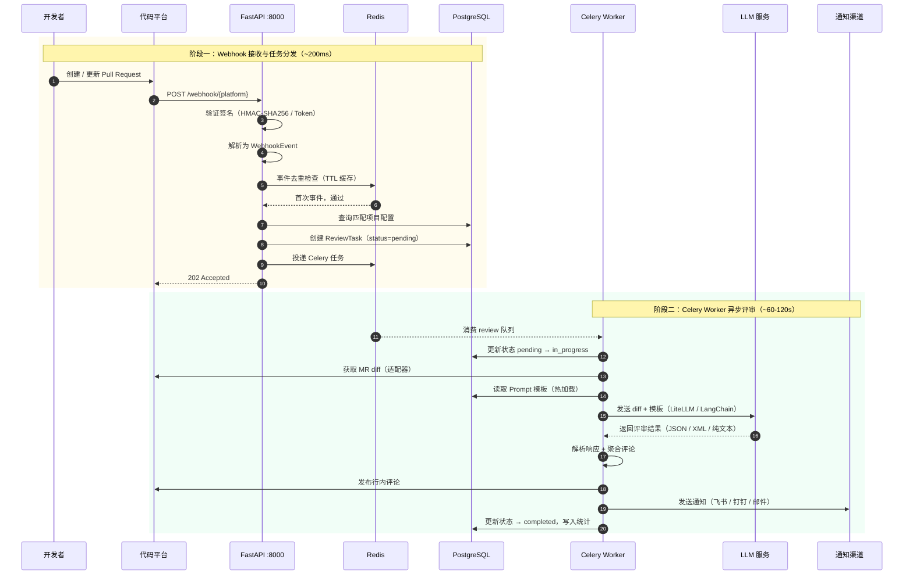
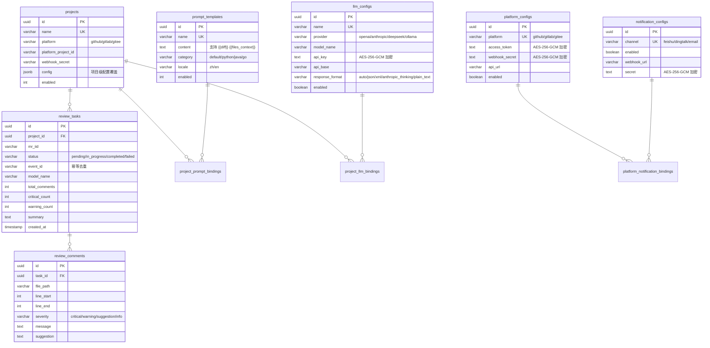
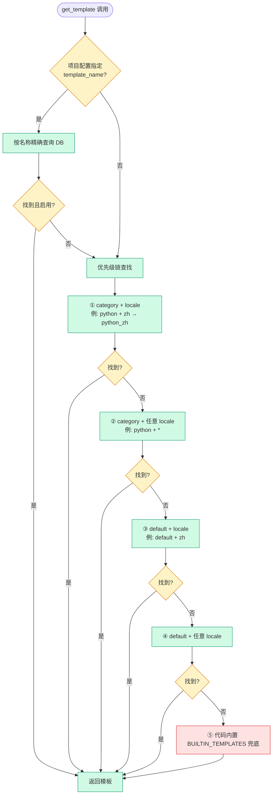
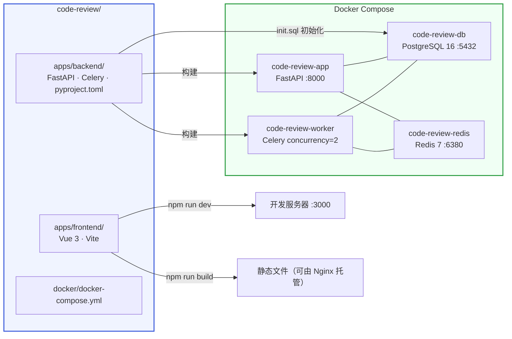

# 系统架构文档

> 基于 Mermaid 语法，可在支持 Mermaid 的 Markdown 编辑器中直接渲染。

---

## 1. 系统架构图

```mermaid
graph TD
    subgraph 外部系统["🌐 外部系统"]
        GitHub["GitHub"]
        GitLab["GitLab"]
        Gitee["Gitee"]
        LLMCloud["LLM 服务\nOpenAI / Claude / DeepSeek / Ollama"]
        Feishu["飞书"]
        DingTalk["钉钉"]
        Email["邮件服务"]
    end

    subgraph 前端["🖥️ 前端 Vue 3（:3000）"]
        Views["页面组件 views/\n项目 / 评审 / 平台 / 通知 / LLM / 模板"]
        Pinia["Pinia 状态管理 stores/"]
        AxiosClient["Axios HTTP 客户端 api/"]
        VueRouter["Vue Router router/"]
    end

    subgraph 后端["🔧 后端 FastAPI（:8000）"]
        subgraph API层["📡 API 层 api/"]
            WebhookEndpoint["POST /webhook\nWebhook 接收 + 签名验证"]
            ProjectsAPI["/projects  项目 CRUD"]
            ReviewsAPI["/reviews  评审列表 / 手动触发"]
            ConfigAPIs["/platform-configs\n/notification-configs\n/llm-configs\n/prompt-templates"]
        end

        subgraph Service层["⚙️ Service 层 services/"]
            ReviewOrchestrator["ReviewOrchestrator\n评审编排引擎"]
            CommentAggregator["CommentAggregator\n相邻合并 · 严重度排序 · 数量截断"]
            ConfigServices["PlatformConfigService\nNotificationConfigService\nLLMConfigService\nPromptTemplateService"]
        end

        subgraph Infra层["🏗️ 基础设施层 infrastructure/"]
            LLMReviewers["LiteLLM 调用器\nLangChain 调用器"]
            ResponseParser["响应解析器\nJSON · XML · Anthropic · 纯文本"]
            NotificationMgr["通知管理器\n飞书 · 钉钉 · 邮件"]
            PromptMgr["PromptManager\n模板热加载（DB 实时查询）"]
            ConfigCrypto["AES-256-GCM 加密\n敏感字段加密存储"]
            RedisCache["Redis TTL 缓存\n事件去重（TTL=3600s）"]
            CeleryApp["Celery 任务队列"]
        end

        subgraph Adapters层["🔌 适配层 adapters/"]
            PlatformFactory["PlatformFactory\n策略模式"]
            GitHubAdapter["GitHubAdapter\nHMAC-SHA256 验证"]
            GitLabAdapter["GitLabAdapter\nToken 验证"]
            GiteeAdapter["GiteeAdapter\nSHA256 验证"]
        end

        subgraph Core层["📦 核心抽象层 core/"]
            PlatformABC["PlatformAdapter ABC"]
            LLMInterface["LLM 接口"]
            NotifyInterface["Notification 接口"]
        end

        subgraph Worker["⚡ Celery Worker（独立进程）"]
            CeleryWorker["异步执行评审任务\nconcurrency=2"]
        end
    end

    subgraph 数据存储["💿 数据存储"]
        PostgreSQL["PostgreSQL 16\nprojects · review_tasks · review_comments\nprompt_templates · platform_configs\nnotification_configs · llm_configs\nproject_prompt_bindings · project_llm_bindings\nplatform_notification_bindings"]
        Redis["Redis 7\nDB0: 事件去重缓存\nDB1: Celery Broker\nDB2: Celery Backend"]
    end

    %% 前端 → 后端
    Views --> Pinia & VueRouter
    Pinia --> AxiosClient
    AxiosClient --> API层

    %% API 层
    WebhookEndpoint --> ReviewOrchestrator
    ReviewsAPI --> ReviewOrchestrator
    ProjectsAPI & ConfigAPIs --> ConfigServices

    %% Service 层
    ReviewOrchestrator --> RedisCache
    ReviewOrchestrator --> CeleryApp --> CeleryWorker
    CeleryWorker --> ReviewOrchestrator

    ReviewOrchestrator --> PlatformFactory
    PlatformFactory --> GitHubAdapter & GitLabAdapter & GiteeAdapter
    GitHubAdapter --> GitHub
    GitLabAdapter --> GitLab
    GiteeAdapter --> Gitee

    ReviewOrchestrator --> LLMReviewers --> LLMCloud
    LLMReviewers --> ResponseParser --> CommentAggregator

    ReviewOrchestrator --> PromptMgr
    ReviewOrchestrator --> NotificationMgr
    NotificationMgr --> Feishu & DingTalk & Email

    ConfigServices --> ConfigCrypto

    %% 抽象接口实现
    GitHubAdapter & GitLabAdapter & GiteeAdapter -.->|实现| PlatformABC
    LLMReviewers -.->|实现| LLMInterface
    NotificationMgr -.->|实现| NotifyInterface

    %% 数据库
    Service层 & API层 & CeleryWorker --> PostgreSQL
    RedisCache & CeleryApp --> Redis

    style 外部系统   fill:#e1f5ff,stroke:#01579b,stroke-width:2px
    style 前端       fill:#f3e5f5,stroke:#4a148c,stroke-width:2px
    style 后端       fill:#e8f5e9,stroke:#1b5e20,stroke-width:2px
    style API层      fill:#fff3e0,stroke:#e65100,stroke-width:1px
    style Service层  fill:#fce4ec,stroke:#880e4f,stroke-width:1px
    style Infra层    fill:#f1f8e9,stroke:#33691e,stroke-width:1px
    style Adapters层 fill:#e0f2f1,stroke:#004d40,stroke-width:1px
    style Core层     fill:#ede7f6,stroke:#311b92,stroke-width:1px
    style Worker     fill:#fff9c4,stroke:#f57f17,stroke-width:1px
    style 数据存储   fill:#ffebee,stroke:#b71c1c,stroke-width:2px
```

---

## 2. 端到端时序图：Webhook → 评审完成

---

## 3. PR 创建到评审完成全流程图

```mermaid
flowchart TD
    DEV(["👨‍💻 开发者\n在 Gitee 创建 Pull Request"])

    subgraph GITEE["🌐 Gitee 平台"]
        PR_EVENT["触发 Webhook 事件\nPOST /webhook/gitee"]
    end

    subgraph API["📡 FastAPI :8000"]
        SIG_CHECK{"SHA256 签名\n验证通过?"}
        SIG_FAIL(["❌ 返回 403\n签名验证失败"])
        PARSE["解析 WebhookEvent\n提取 project_id / mr_iid / action"]
        ACTION_CHECK{"action 是\ncreate 或 update?"}
        IGNORE(["⏭️ 返回 200\n忽略此事件"])
        PROJ_QUERY["查询 projects 表\n匹配 platform + platform_project_id"]
        PROJ_FOUND{"项目存在\n且 enabled?"}
        PROJ_FAIL(["❌ 返回 404\n项目未找到或已禁用"])
        DEDUP{"Redis 去重检查\nevent_id 是否已处理?\nTTL=3600s"}
        DEDUP_SKIP(["⏭️ 返回 200\n重复事件，跳过"])
        CREATE_TASK["PostgreSQL 写入 review_tasks\nstatus=pending"]
        PUSH_CELERY["投递 Celery 任务\nreview 队列"]
        RESP(["✅ 返回 202 Accepted\n任务已受理"])
    end

    subgraph WORKER["⚡ Celery Worker（异步）"]
        START_REVIEW["拉取任务\n更新状态 → in_progress"]

        subgraph PLATFORM_CFG["平台配置读取"]
            READ_DB_CFG["读取 platform_configs 表\naccess_token / api_url"]
            CFG_EMPTY{"token 为空?"}
            READ_ENV_CFG["降级：读取环境变量\nPLATFORM_TOKEN"]
        end

        GET_DIFF["调用 Gitee API\n获取 MR diff 文件列表"]
        FILTER["按 exclude_patterns 过滤\n跳过 *.lock / *.min.js 等"]
        DIFF_EMPTY{"diff 为空?"}
        SKIP_EMPTY(["⏭️ 更新状态 completed\n无需评审"])

        subgraph PROMPT["Prompt 加载"]
            READ_BINDINGS["查询 project_prompt_bindings\n获取项目绑定模板"]
            TEMPLATE_MATCH["按优先级匹配模板\ncategory+locale → default → 内置兜底"]
            RENDER_PROMPT["渲染模板\n填入 {{diff}} {{files_context}}"]
        end

        subgraph LLM_CALL["LLM 调用"]
            READ_LLM_CFG["查询 project_llm_bindings\n获取绑定的 LLM 配置"]
            CALL_LLM["LiteLLM 调用大模型\nDeepSeek / OpenAI / Claude…"]
            LLM_FAIL{"调用失败\n或超时?"}
            RETRY["重试（tenacity）\n最多 3 次"]
            PARSE_RESP["ResponseParser 解析响应\nJSON / XML / Anthropic / 纯文本"]
        end

        subgraph AGGREGATE["评论聚合"]
            AGGREGATE_CMT["CommentAggregator\n相邻行合并（间距≤5）\n按严重程度排序"]
            TRUNCATE{"评论数\n超过 max_comments?"}
            CUT["按 critical→warning→suggestion\n优先级截断"]
        end

        POST_CMT["调用 Gitee API\n发布行内评论到 MR"]

        subgraph NOTIFY["通知推送"]
            QUERY_BINDING["查询 platform_notification_bindings\n获取绑定的通知渠道"]
            SEND_NOTIFY["发送通知\n飞书 / 钉钉 / 邮件"]
        end

        DONE(["✅ 更新 review_tasks\nstatus=completed\n写入统计数据"])
        FAIL(["❌ 更新 review_tasks\nstatus=failed\n记录 error_message"])
    end

    DEV --> PR_EVENT --> SIG_CHECK
    SIG_CHECK -- 失败 --> SIG_FAIL
    SIG_CHECK -- 通过 --> PARSE --> ACTION_CHECK
    ACTION_CHECK -- 否 --> IGNORE
    ACTION_CHECK -- 是 --> PROJ_QUERY --> PROJ_FOUND
    PROJ_FOUND -- 否 --> PROJ_FAIL
    PROJ_FOUND -- 是 --> DEDUP
    DEDUP -- 重复 --> DEDUP_SKIP
    DEDUP -- 首次 --> CREATE_TASK --> PUSH_CELERY --> RESP

    PUSH_CELERY -.->|异步消费| START_REVIEW

    START_REVIEW --> READ_DB_CFG --> CFG_EMPTY
    CFG_EMPTY -- 是 --> READ_ENV_CFG
    CFG_EMPTY -- 否 --> GET_DIFF
    READ_ENV_CFG --> GET_DIFF

    GET_DIFF --> FILTER --> DIFF_EMPTY
    DIFF_EMPTY -- 是 --> SKIP_EMPTY
    DIFF_EMPTY -- 否 --> READ_BINDINGS

    READ_BINDINGS --> TEMPLATE_MATCH --> RENDER_PROMPT
    RENDER_PROMPT --> READ_LLM_CFG --> CALL_LLM

    CALL_LLM --> LLM_FAIL
    LLM_FAIL -- 是 --> RETRY --> CALL_LLM
    LLM_FAIL -- 否\n3次均失败 --> FAIL
    LLM_FAIL -- 成功 --> PARSE_RESP

    PARSE_RESP --> AGGREGATE_CMT --> TRUNCATE
    TRUNCATE -- 是 --> CUT --> POST_CMT
    TRUNCATE -- 否 --> POST_CMT

    POST_CMT --> QUERY_BINDING --> SEND_NOTIFY --> DONE

    classDef terminal  fill:#d1fae5,stroke:#059669,color:#065f46
    classDef fail      fill:#fee2e2,stroke:#dc2626,color:#7f1d1d
    classDef skip      fill:#fef3c7,stroke:#d97706,color:#78350f
    classDef decision  fill:#ede9fe,stroke:#7c3aed,color:#3b0764
    classDef platform  fill:#e0f2fe,stroke:#0284c7,color:#0c4a6e
    classDef action    fill:#f0fdf4,stroke:#16a34a,color:#14532d

    class DONE terminal
    class SIG_FAIL,PROJ_FAIL,FAIL fail
    class IGNORE,DEDUP_SKIP,SKIP_EMPTY skip
    class SIG_CHECK,ACTION_CHECK,PROJ_FOUND,DEDUP,DIFF_EMPTY,CFG_EMPTY,LLM_FAIL,TRUNCATE decision
    class DEV,PR_EVENT platform
```

---

## 4. 数据模型关系图

---

## 5. Prompt 模板匹配优先级

---

## 6. 部署架构

---

## 7. 分层职责一览

| 层级 | 目录 | 职责 | 依赖方向 |
|------|------|------|----------|
| API 层 | `api/` | 接收 HTTP 请求，参数校验，调用 service | → services |
| Service 层 | `services/` | 业务流程编排，事务边界 | → infrastructure, adapters |
| 基础设施层 | `infrastructure/` | LLM、通知、缓存、加密等外部集成 | → core |
| 适配层 | `adapters/` | 代码平台 API 封装，实现 core 接口 | → core |
| 核心抽象层 | `core/` | ABC 接口定义，无外部依赖 | 无 |
| 模型层 | `models/` | SQLAlchemy ORM + Pydantic 配置模型 | → 数据库 |
| Schema 层 | `schemas/` | API 请求/响应 Schema | 无 |
