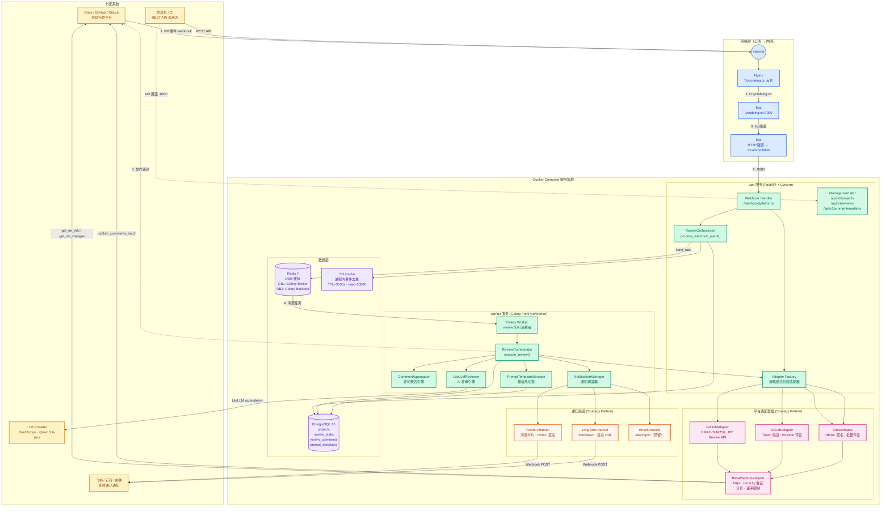
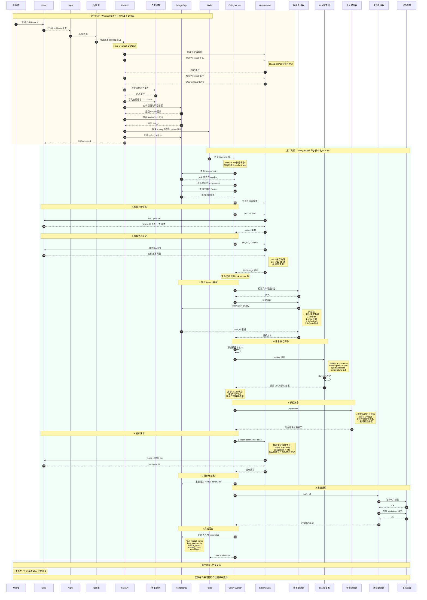
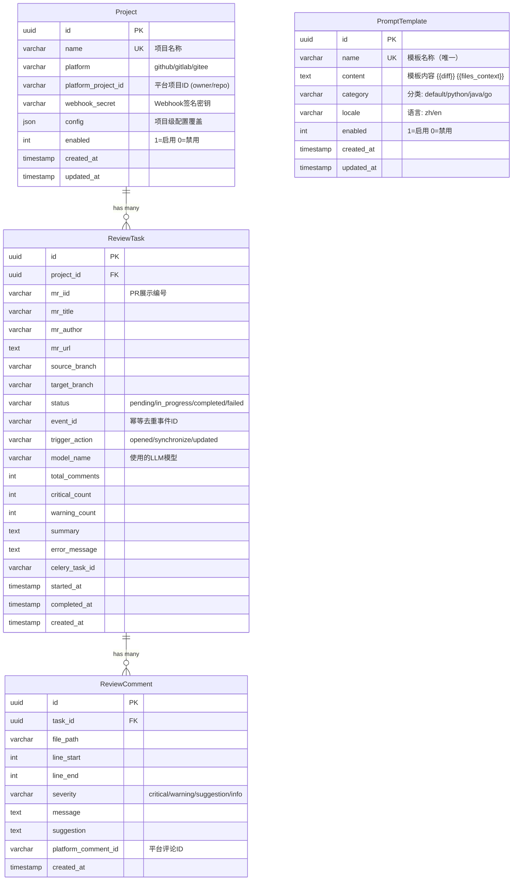
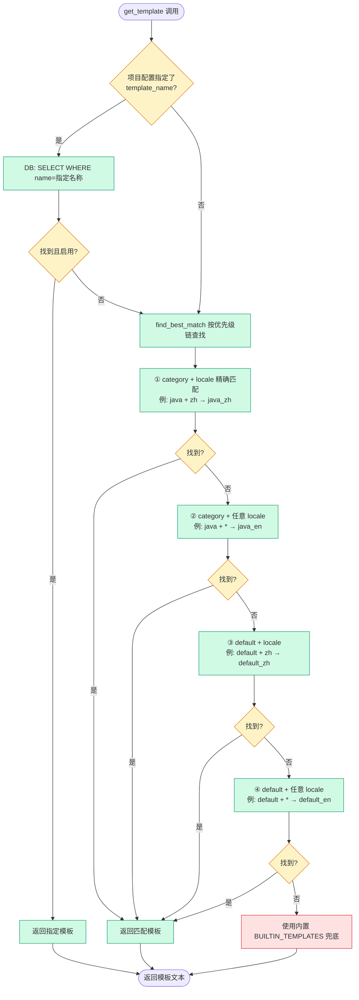
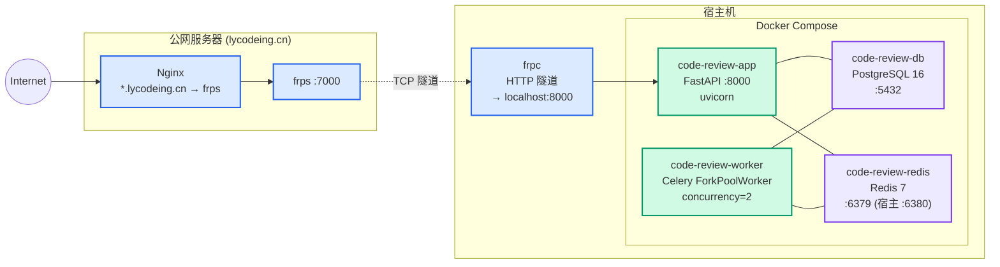

# Code Review 系统架构图与时序流程图

> 基于 Mermaid 语法，可直接在任何支持 Mermaid 的 Markdown 编辑器中渲染。

---

## 1. 系统架构图（组件关系与数据流向）

---

## 2. 端到端时序流程图

---

## 3. 核心数据模型关系图

---

## 4. Prompt 模板匹配优先级

---

## 5. Docker 部署架构

