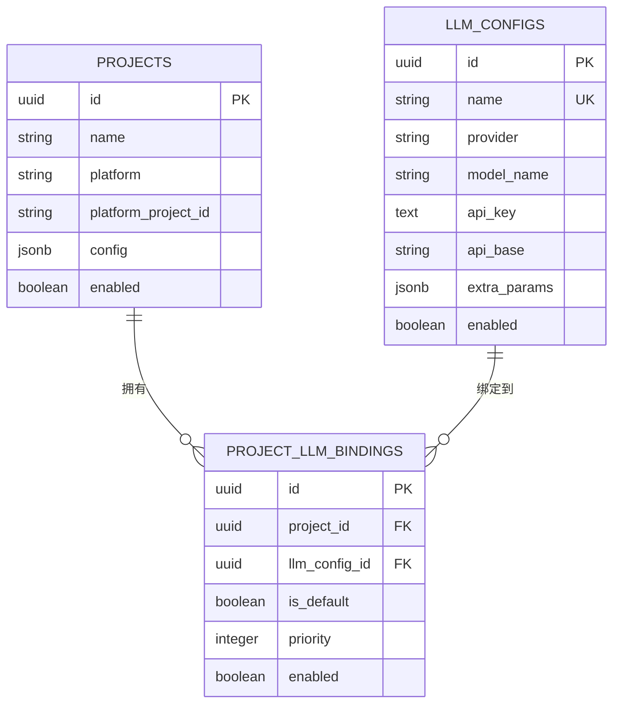

# LLM 配置中心设计文档

> 概述：支持多 LLM 提供商配置、项目级配置绑定、优先级选择和降级机制

---

## 1. 设计目标

### 1.1 核心需求
- **多提供商支持**：支持 OpenAI、Anthropic、DeepSeek、Ollama、Azure、Bedrock 等主流 LLM 提供商
- **项目级配置**：不同项目可使用不同的 LLM 配置
- **灵活绑定**：一个项目可绑定多个 LLM 配置，支持优先级和默认选择
- **配置隔离**：敏感信息（API Key）加密存储，API 返回脱敏数据
- **平滑降级**：未配置项目时自动降级到环境变量配置

### 1.2 非功能需求
- 配置热更新：数据库修改后立即生效（无需重启服务）
- 审计友好：记录配置创建/更新时间
- 级联删除：删除项目或 LLM 配置时自动清理关联绑定

---

## 2. 数据库设计

### 2.1 ER 图



### 2.2 SQL DDL

```sql
-- ============================================
-- LLM 配置表
-- ============================================
CREATE TABLE llm_configs (
    id UUID PRIMARY KEY DEFAULT gen_random_uuid(),
    name VARCHAR(255) NOT NULL UNIQUE,
    provider VARCHAR(64) NOT NULL,
    model_name VARCHAR(128) NOT NULL,
    api_key TEXT NOT NULL DEFAULT '',
    api_base VARCHAR(512) NOT NULL DEFAULT '',
    extra_params JSONB,
    enabled BOOLEAN NOT NULL DEFAULT TRUE,
    description VARCHAR(512) NOT NULL DEFAULT '',
    created_at TIMESTAMP NOT NULL DEFAULT CURRENT_TIMESTAMP,
    updated_at TIMESTAMP NOT NULL DEFAULT CURRENT_TIMESTAMP
);

-- 索引
CREATE INDEX idx_llm_configs_provider ON llm_configs(provider);
CREATE INDEX idx_llm_configs_enabled ON llm_configs(enabled);

-- 注释
COMMENT ON TABLE llm_configs IS 'LLM 提供商配置表';
COMMENT ON COLUMN llm_configs.name IS '配置名称（唯一标识），如 "deepseek-chat", "claude-3-5"';
COMMENT ON COLUMN llm_configs.provider IS '提供商：openai/anthropic/deepseek/ollama/azure/bedrock';
COMMENT ON COLUMN llm_configs.model_name IS '模型名称：gpt-4o/claude-3-5-sonnet-20241022/deepseek-chat';
COMMENT ON COLUMN llm_configs.api_key IS 'API 密钥（使用 Fernet 加密存储）';
COMMENT ON COLUMN llm_configs.api_base IS 'API 基础地址，如 https://api.deepseek.com';
COMMENT ON COLUMN llm_configs.extra_params IS '额外参数：{"temperature": 0.3, "max_tokens": 4096}';
COMMENT ON COLUMN llm_configs.enabled IS '是否启用该配置';

-- ============================================
-- 项目-LLM 配置关联表（多对多）
-- ============================================
CREATE TABLE project_llm_bindings (
    id UUID PRIMARY KEY DEFAULT gen_random_uuid(),
    project_id UUID NOT NULL REFERENCES projects(id) ON DELETE CASCADE,
    llm_config_id UUID NOT NULL REFERENCES llm_configs(id) ON DELETE CASCADE,
    is_default BOOLEAN NOT NULL DEFAULT FALSE,
    priority INTEGER NOT NULL DEFAULT 0,
    enabled BOOLEAN NOT NULL DEFAULT TRUE,
    created_at TIMESTAMP NOT NULL DEFAULT CURRENT_TIMESTAMP,
    UNIQUE(project_id, llm_config_id)
);

-- 索引
CREATE INDEX idx_project_llm_project ON project_llm_bindings(project_id);
CREATE INDEX idx_project_llm_config ON project_llm_bindings(llm_config_id);

-- 注释
COMMENT ON TABLE project_llm_bindings IS '项目-LLM 配置关联表';
COMMENT ON COLUMN project_llm_bindings.is_default IS '是否为项目默认配置（优先级最高）';
COMMENT ON COLUMN project_llm_bindings.priority IS '优先级（数字越大优先级越高，未标记 default 时使用）';
COMMENT ON COLUMN project_llm_bindings.enabled IS '绑定是否启用';
```

### 2.3 SQLAlchemy ORM 模型

```python
# src/code_review/models/db.py（添加）

class LLMConfig(Base):
    """LLM 提供商配置表。"""
    __tablename__ = "llm_configs"

    id = Column(UUID(as_uuid=True), primary_key=True, default=uuid.uuid4)
    name = Column(String(255), nullable=False, unique=True, comment="配置名称（唯一标识）")
    provider = Column(String(64), nullable=False, comment="提供商：openai/anthropic/deepseek/ollama/azure/bedrock")
    model_name = Column(String(128), nullable=False, comment="模型名称")
    api_key = Column(Text, nullable=False, default="", comment="API 密钥（加密存储）")
    api_base = Column(String(512), nullable=False, default="", comment="API 基础地址")
    extra_params = Column(JSON, nullable=True, comment="额外参数（temperature/max_tokens/等）")
    enabled = Column(Boolean, nullable=False, default=True, comment="是否启用")
    description = Column(String(512), nullable=False, default="", comment="说明文字")
    created_at = Column(DateTime, nullable=False, default=datetime.utcnow)
    updated_at = Column(DateTime, nullable=False, default=datetime.utcnow, onupdate=datetime.utcnow)

    project_bindings = relationship(
        "ProjectLLMBinding",
        back_populates="llm_config",
        cascade="all, delete-orphan",
    )

    __table_args__ = (
        Index("idx_llm_configs_provider", "provider"),
        Index("idx_llm_configs_enabled", "enabled"),
    )

    def __repr__(self) -> str:
        return f"<LLMConfig {self.name} [{self.provider}/{self.model_name}]>"


class ProjectLLMBinding(Base):
    """项目-LLM 配置关联表（多对多）。"""
    __tablename__ = "project_llm_bindings"

    id = Column(UUID(as_uuid=True), primary_key=True, default=uuid.uuid4)
    project_id = Column(
        UUID(as_uuid=True),
        ForeignKey("projects.id", ondelete="CASCADE"),
        nullable=False,
    )
    llm_config_id = Column(
        UUID(as_uuid=True),
        ForeignKey("llm_configs.id", ondelete="CASCADE"),
        nullable=False,
    )
    is_default = Column(Boolean, nullable=False, default=False, comment="是否为项目默认配置")
    priority = Column(Integer, nullable=False, default=0, comment="优先级（数字越大优先级越高）")
    enabled = Column(Boolean, nullable=False, default=True, comment="绑定是否启用")
    created_at = Column(DateTime, nullable=False, default=datetime.utcnow)

    project = relationship("Project")
    llm_config = relationship("LLMConfig", back_populates="project_bindings")

    __table_args__ = (
        UniqueConstraint("project_id", "llm_config_id", name="uq_project_llm"),
        Index("idx_project_llm_project", "project_id"),
        Index("idx_project_llm_config", "llm_config_id"),
    )

    def __repr__(self) -> str:
        return f"<ProjectLLMBinding {self.project_id}->{self.llm_config_id}>"
```

---

## 3. API 设计

### 3.1 REST 端点概览

| 方法 | 路径 | 描述 |
|------|------|------|
| **LLM 配置管理** |
| GET | `/api/v1/llm-configs` | 列出所有 LLM 配置 |
| POST | `/api/v1/llm-configs` | 创建新的 LLM 配置 |
| GET | `/api/v1/llm-configs/{id}` | 获取指定 LLM 配置详情 |
| PUT | `/api/v1/llm-configs/{id}` | 更新 LLM 配置 |
| DELETE | `/api/v1/llm-configs/{id}` | 删除 LLM 配置 |
| PATCH | `/api/v1/llm-configs/{id}/enable` | 启用/禁用 LLM 配置 |
| **项目绑定管理** |
| GET | `/api/v1/projects/{project_id}/llm-bindings` | 获取项目的 LLM 绑定列表 |
| POST | `/api/v1/projects/{project_id}/llm-bindings` | 为项目添加 LLM 绑定 |
| PUT | `/api/v1/projects/{project_id}/llm-bindings/{binding_id}` | 更新绑定配置 |
| DELETE | `/api/v1/projects/{project_id}/llm-bindings/{binding_id}` | 删除绑定 |
| PATCH | `/api/v1/projects/{project_id}/llm-bindings/{binding_id}/set-default` | 设置默认配置 |

### 3.2 Pydantic 请求/响应模型

```python
# src/code_review/schemas/llm_config.py

from pydantic import BaseModel, Field, field_validator
from typing import Optional, Dict, Any
from uuid import UUID
from datetime import datetime


class LLMConfigCreate(BaseModel):
    """创建 LLM 配置请求。"""
    name: str = Field(..., min_length=1, max_length=255, description="配置名称（唯一）")
    provider: str = Field(..., pattern="^(openai|anthropic|deepseek|ollama|azure|bedrock)$")
    model_name: str = Field(..., min_length=1, max_length=128, description="模型名称")
    api_key: str = Field(..., min_length=0, description="API 密钥")
    api_base: str = Field(default="", description="API 基础地址")
    extra_params: Optional[Dict[str, Any]] = Field(default=None, description="额外参数")
    enabled: bool = Field(default=True, description="是否启用")
    description: str = Field(default="", max_length=512, description="说明")


class LLMConfigUpdate(BaseModel):
    """更新 LLM 配置请求（所有字段可选）。"""
    provider: Optional[str] = Field(None, pattern="^(openai|anthropic|deepseek|ollama|azure|bedrock)$")
    model_name: Optional[str] = Field(None, min_length=1, max_length=128)
    api_key: Optional[str] = None
    api_base: Optional[str] = None
    extra_params: Optional[Dict[str, Any]] = None
    enabled: Optional[bool] = None
    description: Optional[str] = Field(None, max_length=512)


class LLMConfigResponse(BaseModel):
    """LLM 配置响应（API Key 脱敏）。"""
    id: UUID
    name: str
    provider: str
    model_name: str
    api_key: str  # 脱敏为 "********"
    api_base: str
    extra_params: Optional[Dict[str, Any]]
    enabled: bool
    description: str
    created_at: datetime
    updated_at: datetime

    @field_validator('api_key', mode='before')
    @classmethod
    def mask_api_key(cls, v: str) -> str:
        """脱敏 API Key。"""
        return "********" if v and v != "********" else v


class LLMBindingCreate(BaseModel):
    """创建项目-LLM 绑定请求。"""
    llm_config_id: UUID
    is_default: bool = Field(default=False, description="是否设为默认")
    priority: int = Field(default=0, ge=0, le=100, description="优先级（0-100）")


class LLMBindingUpdate(BaseModel):
    """更新绑定请求。"""
    is_default: Optional[bool] = None
    priority: Optional[int] = Field(None, ge=0, le=100)
    enabled: Optional[bool] = None


class LLMBindingResponse(BaseModel):
    """绑定响应。"""
    id: UUID
    project_id: UUID
    llm_config_id: UUID
    llm_config: LLMConfigResponse
    is_default: bool
    priority: int
    enabled: bool
    created_at: datetime
```

### 3.3 API 实现示例

```python
# src/code_review/api/llm_config.py

from fastapi import APIRouter, HTTPException, Depends, status
from sqlalchemy.ext.asyncio import AsyncSession
from uuid import UUID
from typing import List

from code_review.models.db import LLMConfig, ProjectLLMBinding
from code_review.schemas.llm_config import (
    LLMConfigCreate, LLMConfigUpdate, LLMConfigResponse,
    LLMBindingCreate, LLMBindingUpdate, LLMBindingResponse,
)
from code_review.infrastructure.config_crypto import ConfigCrypto

router = APIRouter(prefix="/llm-configs", tags=["llm-configs"])


@router.get("", response_model=List[LLMConfigResponse])
async def list_llm_configs(
    enabled_only: bool = False,
    session: AsyncSession = Depends(get_session),
):
    """列出所有 LLM 配置。"""
    stmt = select(LLMConfig)
    if enabled_only:
        stmt = stmt.where(LLMConfig.enabled == True)
    stmt = stmt.order_by(LLMConfig.created_at.desc())
    result = await session.execute(stmt)
    configs = result.scalars().all()
    return configs


@router.post("", response_model=LLMConfigResponse, status_code=status.HTTP_201_CREATED)
async def create_llm_config(
    data: LLMConfigCreate,
    session: AsyncSession = Depends(get_session),
):
    """创建新的 LLM 配置。"""
    # 检查名称唯一性
    existing = await session.get(LLMConfig, data.name)
    if existing:
        raise HTTPException(status_code=400, detail="配置名称已存在")

    # 加密 API Key
    encrypted_key = ConfigCrypto.encrypt(data.api_key)

    config = LLMConfig(
        name=data.name,
        provider=data.provider,
        model_name=data.model_name,
        api_key=encrypted_key,
        api_base=data.api_base,
        extra_params=data.extra_params,
        enabled=data.enabled,
        description=data.description,
    )
    session.add(config)
    await session.commit()
    await session.refresh(config)
    return config


@router.get("/{config_id}", response_model=LLMConfigResponse)
async def get_llm_config(
    config_id: UUID,
    session: AsyncSession = Depends(get_session),
):
    """获取指定 LLM 配置详情。"""
    config = await session.get(LLMConfig, config_id)
    if not config:
        raise HTTPException(status_code=404, detail="配置不存在")
    return config


@router.put("/{config_id}", response_model=LLMConfigResponse)
async def update_llm_config(
    config_id: UUID,
    data: LLMConfigUpdate,
    session: AsyncSession = Depends(get_session),
):
    """更新 LLM 配置。"""
    config = await session.get(LLMConfig, config_id)
    if not config:
        raise HTTPException(status_code=404, detail="配置不存在")

    for field, value in data.model_dump(exclude_unset=True).items():
        if field == "api_key" and value:
            value = ConfigCrypto.encrypt(value)
        setattr(config, field, value)

    await session.commit()
    await session.refresh(config)
    return config


@router.delete("/{config_id}", status_code=status.HTTP_204_NO_CONTENT)
async def delete_llm_config(
    config_id: UUID,
    session: AsyncSession = Depends(get_session),
):
    """删除 LLM 配置。"""
    config = await session.get(LLMConfig, config_id)
    if not config:
        raise HTTPException(status_code=404, detail="配置不存在")
    await session.delete(config)
    await session.commit()


@router.patch("/{config_id}/enable", response_model=LLMConfigResponse)
async def toggle_llm_config(
    config_id: UUID,
    enabled: bool,
    session: AsyncSession = Depends(get_session),
):
    """启用/禁用 LLM 配置。"""
    config = await session.get(LLMConfig, config_id)
    if not config:
        raise HTTPException(status_code=404, detail="配置不存在")
    config.enabled = enabled
    await session.commit()
    await session.refresh(config)
    return config


# 项目绑定管理
@router.get("/projects/{project_id}/llm-bindings", response_model=List[LLMBindingResponse])
async def list_project_bindings(
    project_id: UUID,
    session: AsyncSession = Depends(get_session),
):
    """获取项目的 LLM 绑定列表。"""
    stmt = (
        select(ProjectLLMBinding)
        .where(ProjectLLMBinding.project_id == project_id)
        .order_by(ProjectLLMBinding.priority.desc(), ProjectLLMBinding.created_at)
    )
    result = await session.execute(stmt)
    bindings = result.scalars().all()
    return bindings


@router.post("/projects/{project_id}/llm-bindings", response_model=LLMBindingResponse, status_code=status.HTTP_201_CREATED)
async def create_binding(
    project_id: UUID,
    data: LLMBindingCreate,
    session: AsyncSession = Depends(get_session),
):
    """为项目添加 LLM 绑定。"""
    # 检查项目是否存在
    from code_review.models.db import Project
    project = await session.get(Project, project_id)
    if not project:
        raise HTTPException(status_code=404, detail="项目不存在")

    # 检查 LLM 配置是否存在
    llm_config = await session.get(LLMConfig, data.llm_config_id)
    if not llm_config:
        raise HTTPException(status_code=404, detail="LLM 配置不存在")

    # 如果设置为默认，清除其他默认标记
    if data.is_default:
        await session.execute(
            select(ProjectLLMBinding).where(
                ProjectLLMBinding.project_id == project_id,
                ProjectLLMBinding.is_default == True,
            )
        )
        # 批量更新为非默认...

    binding = ProjectLLMBinding(
        project_id=project_id,
        llm_config_id=data.llm_config_id,
        is_default=data.is_default,
        priority=data.priority,
    )
    session.add(binding)
    await session.commit()
    await session.refresh(binding)
    return binding
```

---

## 4. 评审服务配置选择逻辑

### 4.1 配置选择优先级

```
┌─────────────────────────────────────────────────────────────┐
│  评审触发：Webhook 事件 → 项目 ID                              │
└─────────────────────────────────────────────────────────────┘
                              │
                              ▼
            ┌─────────────────────────────────┐
            │ 1. 查找项目默认绑定               │
            │    (is_default = TRUE)           │
            └─────────────────────────────────┘
                     │ 找到?
                     ├── YES ──→ 使用此配置
                     │ NO
                     ▼
            ┌─────────────────────────────────┐
            │ 2. 查找项目最高优先级绑定         │
            │    (ORDER BY priority DESC)      │
            └─────────────────────────────────┘
                     │ 找到?
                     ├── YES ──→ 使用此配置
                     │ NO
                     ▼
            ┌─────────────────────────────────┐
            │ 3. 查找全局默认配置               │
            │    (name = 'default')            │
            └─────────────────────────────────┘
                     │ 找到?
                     ├── YES ──→ 使用此配置
                     │ NO
                     ▼
            ┌─────────────────────────────────┐
            │ 4. 降级到环境变量配置             │
            │    (CODE_REVIEW__LLM__*)        │
            └─────────────────────────────────┘
```

### 4.2 服务实现

```python
# src/code_review/services/llm_config_service.py

from sqlalchemy import select
from sqlalchemy.ext.asyncio import AsyncSession
from uuid import UUID
from typing import Optional

from code_review.models.db import LLMConfig, ProjectLLMBinding


class LLMConfigService:
    """LLM 配置服务。"""

    async def get_llm_config_for_project(
        self, session: AsyncSession, project_id: UUID
    ) -> Optional[LLMConfig]:
        """获取项目的 LLM 配置。

        选择优先级：
        1. 项目的默认绑定（is_default=True）
        2. 项目的最高优先级绑定（priority DESC）
        3. 全局默认配置（name='default'）
        4. None（返回 None，由调用方降级到环境变量）
        """
        # 1. 查找项目默认绑定
        stmt = (
            select(LLMConfig)
            .join(ProjectLLMBinding)
            .where(
                ProjectLLMBinding.project_id == project_id,
                ProjectLLMBinding.is_default == True,
                ProjectLLMBinding.enabled == True,
                LLMConfig.enabled == True,
            )
        )
        result = await session.execute(stmt)
        config = result.scalar_one_or_none()
        if config:
            return config

        # 2. 查找项目最高优先级绑定
        stmt = (
            select(LLMConfig)
            .join(ProjectLLMBinding)
            .where(
                ProjectLLMBinding.project_id == project_id,
                ProjectLLMBinding.enabled == True,
                LLMConfig.enabled == True,
            )
            .order_by(ProjectLLMBinding.priority.desc())
            .limit(1)
        )
        result = await session.execute(stmt)
        config = result.scalar_one_or_none()
        if config:
            return config

        # 3. 查找全局默认配置
        stmt = select(LLMConfig).where(
            LLMConfig.name == "default",
            LLMConfig.enabled == True,
        )
        result = await session.execute(stmt)
        return result.scalar_one_or_none()

    async def decrypt_api_key(self, encrypted_key: str) -> str:
        """解密 API Key。"""
        from code_review.infrastructure.config_crypto import ConfigCrypto
        return ConfigCrypto.decrypt(encrypted_key)
```

### 4.3 集成到评审编排器

```python
# src/code_review/services/review_orchestrator.py（修改）

from code_review.services.llm_config_service import LLMConfigService
from code_review.infrastructure.llm_reviewer import LiteLLMReviewer


class ReviewOrchestrator:
    """评审编排器。"""

    def __init__(self, ...):
        # ...
        self._llm_config_service = LLMConfigService()

    async def execute_review(self, task_id: UUID) -> ReviewResult:
        """执行评审任务。"""
        async with self._session_factory() as session:
            task = await session.get(ReviewTask, task_id)
            if not task:
                raise ValueError(f"Task {task_id} not found")

            # 获取 LLM 配置
            llm_config = await self._llm_config_service.get_llm_config_for_project(
                session, task.project_id
            )

            if llm_config:
                # 使用数据库配置
                api_key = await self._llm_config_service.decrypt_api_key(llm_config.api_key)
                model_config = {
                    "provider": llm_config.provider,
                    "model": llm_config.model_name,
                    "api_key": api_key,
                    "api_base": llm_config.api_base or None,
                    **(llm_config.extra_params or {}),
                }
                task.model_name = f"{llm_config.provider}/{llm_config.model_name}"
            else:
                # 降级到环境变量配置
                model_config = {
                    "provider": self._config.llm.provider,
                    "model": self._config.llm.model,
                    "api_key": self._config.llm.api_key,
                }
                task.model_name = self._config.llm.model

            await session.commit()

            # 创建 LLM 审查器
            reviewer = LiteLLMReviewer(model_config)

            # 执行评审...
            result = await reviewer.review_diff(diff, prompt_template)

            return result
```

---

## 5. 数据库迁移

### 5.1 Alembic 迁移脚本

```python
# alembic/versions/002_add_llm_configs.py

"""add llm configs

Revision ID: 002_add_llm_configs
Revises: 001_init
Create Date: 2026-04-18

"""
from alembic import op
import sqlalchemy as sa
from sqlalchemy.dialects import postgresql

revision = '002_add_llm_configs'
down_revision = '001_init'
branch_labels = None
depends_on = None


def upgrade():
    # 创建 llm_configs 表
    op.create_table(
        'llm_configs',
        sa.Column('id', postgresql.UUID(as_uuid=True), primary_key=True, server_default=sa.text('gen_random_uuid()')),
        sa.Column('name', sa.String(255), nullable=False),
        sa.Column('provider', sa.String(64), nullable=False),
        sa.Column('model_name', sa.String(128), nullable=False),
        sa.Column('api_key', sa.Text(), nullable=False, server_default=''),
        sa.Column('api_base', sa.String(512), nullable=False, server_default=''),
        sa.Column('extra_params', postgresql.JSONB(), nullable=True),
        sa.Column('enabled', sa.Boolean(), nullable=False, server_default='TRUE'),
        sa.Column('description', sa.String(512), nullable=False, server_default=''),
        sa.Column('created_at', sa.TIMESTAMP(), nullable=False, server_default=sa.text('CURRENT_TIMESTAMP')),
        sa.Column('updated_at', sa.TIMESTAMP(), nullable=False, server_default=sa.text('CURRENT_TIMESTAMP')),
    )
    op.create_index('idx_llm_configs_provider', 'llm_configs', ['provider'])
    op.create_index('idx_llm_configs_enabled', 'llm_configs', ['enabled'])
    op.create_constraint('uq_llm_config_name', 'llm_configs', 'unique', ['name'])

    # 创建 project_llm_bindings 表
    op.create_table(
        'project_llm_bindings',
        sa.Column('id', postgresql.UUID(as_uuid=True), primary_key=True, server_default=sa.text('gen_random_uuid()')),
        sa.Column('project_id', postgresql.UUID(as_uuid=True), nullable=False),
        sa.Column('llm_config_id', postgresql.UUID(as_uuid=True), nullable=False),
        sa.Column('is_default', sa.Boolean(), nullable=False, server_default='FALSE'),
        sa.Column('priority', sa.Integer(), nullable=False, server_default='0'),
        sa.Column('enabled', sa.Boolean(), nullable=False, server_default='TRUE'),
        sa.Column('created_at', sa.TIMESTAMP(), nullable=False, server_default=sa.text('CURRENT_TIMESTAMP')),
        sa.ForeignKeyConstraint(['project_id'], ['projects.id'], ondelete='CASCADE'),
        sa.ForeignKeyConstraint(['llm_config_id'], ['llm_configs.id'], ondelete='CASCADE'),
        sa.UniqueConstraint('project_id', 'llm_config_id', name='uq_project_llm'),
    )
    op.create_index('idx_project_llm_project', 'project_llm_bindings', ['project_id'])
    op.create_index('idx_project_llm_config', 'project_llm_bindings', ['llm_config_id'])

    # 插入默认全局配置
    op.execute("""
        INSERT INTO llm_configs (name, provider, model_name, enabled, description)
        VALUES ('default', 'openai', 'gpt-4o', TRUE, '全局默认 LLM 配置')
    """)


def downgrade():
    op.drop_table('project_llm_bindings')
    op.drop_table('llm_configs')
```

### 5.2 手动 SQL 迁移

```sql
-- migrations/002_add_llm_configs.sql

-- ============================================
-- 创建 LLM 配置表
-- ============================================
CREATE TABLE llm_configs (
    id UUID PRIMARY KEY DEFAULT gen_random_uuid(),
    name VARCHAR(255) NOT NULL UNIQUE,
    provider VARCHAR(64) NOT NULL,
    model_name VARCHAR(128) NOT NULL,
    api_key TEXT NOT NULL DEFAULT '',
    api_base VARCHAR(512) NOT NULL DEFAULT '',
    extra_params JSONB,
    enabled BOOLEAN NOT NULL DEFAULT TRUE,
    description VARCHAR(512) NOT NULL DEFAULT '',
    created_at TIMESTAMP NOT NULL DEFAULT CURRENT_TIMESTAMP,
    updated_at TIMESTAMP NOT NULL DEFAULT CURRENT_TIMESTAMP
);

CREATE INDEX idx_llm_configs_provider ON llm_configs(provider);
CREATE INDEX idx_llm_configs_enabled ON llm_configs(enabled);

-- ============================================
-- 创建项目-LLM 绑定表
-- ============================================
CREATE TABLE project_llm_bindings (
    id UUID PRIMARY KEY DEFAULT gen_random_uuid(),
    project_id UUID NOT NULL REFERENCES projects(id) ON DELETE CASCADE,
    llm_config_id UUID NOT NULL REFERENCES llm_configs(id) ON DELETE CASCADE,
    is_default BOOLEAN NOT NULL DEFAULT FALSE,
    priority INTEGER NOT NULL DEFAULT 0,
    enabled BOOLEAN NOT NULL DEFAULT TRUE,
    created_at TIMESTAMP NOT NULL DEFAULT CURRENT_TIMESTAMP,
    UNIQUE(project_id, llm_config_id)
);

CREATE INDEX idx_project_llm_project ON project_llm_bindings(project_id);
CREATE INDEX idx_project_llm_config ON project_llm_bindings(llm_config_id);

-- ============================================
-- 插入默认全局配置（可选）
-- ============================================
INSERT INTO llm_configs (name, provider, model_name, enabled, description)
VALUES ('default', 'openai', 'gpt-4o', TRUE, '全局默认 LLM 配置');
```

---

## 6. 配置加密机制

### 6.1 加密服务

复用现有的 `ConfigCrypto` 类：

```python
# src/code_review/infrastructure/config_crypto.py

import base64
import hashlib
from cryptography.fernet import Fernet


class ConfigCrypto:
    """配置加密服务（复用）。"""

    _fernet: Fernet | None = None

    @classmethod
    def initialize(cls, secret_key: str) -> None:
        """从 SERVER__SECRET_KEY 派生加密密钥。"""
        key = base64.urlsafe_b64encode(
            hashlib.sha256(secret_key.encode()).digest()
        )
        cls._fernet = Fernet(key)

    @classmethod
    def encrypt(cls, plaintext: str) -> str:
        """加密。"""
        if not cls._fernet:
            return plaintext
        return cls._fernet.encrypt(plaintext.encode()).decode()

    @classmethod
    def decrypt(cls, ciphertext: str) -> str:
        """解密。"""
        if not cls._fernet or not ciphertext:
            return ciphertext
        try:
            return cls._fernet.decrypt(ciphertext.encode()).decode()
        except Exception:
            return ciphertext
```

### 6.2 API 响应脱敏

```python
# Pydantic 模型中的脱敏处理
class LLMConfigResponse(BaseModel):
    # ...
    api_key: str  # 自动脱敏

    @field_validator('api_key', mode='before')
    @classmethod
    def mask_api_key(cls, v: str) -> str:
        """脱敏 API Key。"""
        if not v or len(v) < 8:
            return "********"
        return f"{v[:4]}...{v[-4:]}"  # 或直接返回 "********"
```

---

## 7. 使用示例

### 7.1 创建 LLM 配置

```bash
# 创建 DeepSeek 配置
curl -X POST http://localhost:8000/api/v1/llm-configs \
  -H "Content-Type: application/json" \
  -d '{
    "name": "deepseek-chat",
    "provider": "deepseek",
    "model_name": "deepseek-chat",
    "api_key": "sk-xxxxx",
    "api_base": "https://api.deepseek.com",
    "extra_params": {
      "temperature": 0.3,
      "max_tokens": 4096
    },
    "enabled": true,
    "description": "DeepSeek 聊天模型"
  }'

# 创建 Claude 配置
curl -X POST http://localhost:8000/api/v1/llm-configs \
  -H "Content-Type: application/json" \
  -d '{
    "name": "claude-3-5",
    "provider": "anthropic",
    "model_name": "claude-3-5-sonnet-20241022",
    "api_key": "sk-ant-xxxxx",
    "api_base": "https://api.anthropic.com",
    "enabled": true,
    "description": "Claude 3.5 Sonnet"
  }'
```

### 7.2 绑定到项目

```bash
# 获取项目 ID
PROJECT_ID=$(curl http://localhost:8000/api/v1/projects | jq '.[0].id' -r)

# 绑定 LLM 配置到项目（设为默认）
curl -X POST http://localhost:8000/api/v1/projects/$PROJECT_ID/llm-bindings \
  -H "Content-Type: application/json" \
  -d '{
    "llm_config_id": "'$(curl http://localhost:8000/api/v1/llm-configs | jq '.[0].id' -r)'",
    "is_default": true,
    "priority": 100
  }'

# 添加备用配置
curl -X POST http://localhost:8000/api/v1/projects/$PROJECT_ID/llm-bindings \
  -H "Content-Type: application/json" \
  -d '{
    "llm_config_id": "'$(curl http://localhost:8000/api/v1/llm-configs | jq '.[1].id' -r)'",
    "is_default": false,
    "priority": 50
  }'
```

### 7.3 触发评审

```bash
# 触发 Webhook 后，系统会自动使用项目绑定的 LLM 配置
# 如果没有绑定，则降级到环境变量配置
```

---

## 8. 总结

### 8.1 设计亮点

1. **灵活的多对多关联**：一个项目可绑定多个 LLM 配置，支持优先级和默认选择
2. **平滑降级机制**：数据库配置 → 环境变量，确保向后兼容
3. **配置热更新**：数据库修改后立即生效，无需重启服务
4. **敏感信息保护**：API Key 加密存储，API 响应脱敏
5. **级联删除**：删除项目或配置时自动清理关联

### 8.2 扩展性

- 未来可支持按分支/语言选择不同配置
- 可添加配置使用统计和计费功能
- 可支持 A/B 测试不同模型效果

### 8.3 兼容性

- 完全向后兼容现有环境变量配置
- 现有项目无需任何修改即可继续使用
- 新项目可选择使用数据库配置或环境变量
