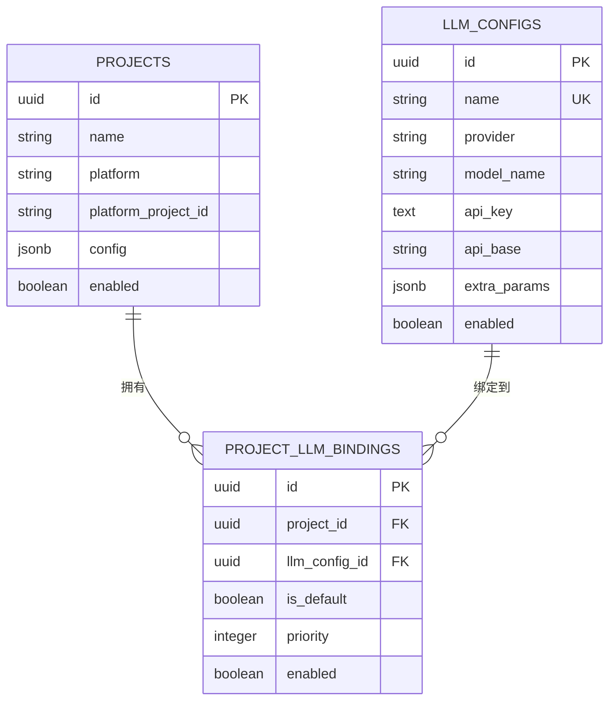

# LLM 配置中心设计文档

> 概述：支持多 LLM 提供商配置、项目级配置绑定、优先级选择和降级机制

---

## 1. 设计目标

### 1.1 核心需求

- **多提供商支持**：支持 OpenAI、Anthropic、DeepSeek、Ollama、Azure、Bedrock 等主流 LLM 提供商
- **项目级配置**：不同项目可使用不同的 LLM 配置
- **灵活绑定**：一个项目可绑定多个 LLM 配置，支持优先级和默认选择
- **配置隔离**：敏感信息（API Key）加密存储，API 返回脱敏数据
- **平滑降级**：未配置项目时自动降级到环境变量配置

### 1.2 非功能需求

- 配置热更新：数据库修改后立即生效（无需重启服务）
- 审计友好：记录配置创建/更新时间
- 级联删除：删除项目或 LLM 配置时自动清理关联绑定

---

## 2. 数据库设计

### 2.1 ER 图



### 2.2 SQL DDL

```sql
-- LLM 配置表
CREATE TABLE llm_configs (
    id UUID PRIMARY KEY DEFAULT gen_random_uuid(),
    name VARCHAR(255) NOT NULL UNIQUE,
    provider VARCHAR(64) NOT NULL,
    model_name VARCHAR(128) NOT NULL,
    api_key TEXT NOT NULL DEFAULT '',
    api_base VARCHAR(512) NOT NULL DEFAULT '',
    extra_params JSONB,
    enabled BOOLEAN NOT NULL DEFAULT TRUE,
    description VARCHAR(512) NOT NULL DEFAULT '',
    created_at TIMESTAMP NOT NULL DEFAULT CURRENT_TIMESTAMP,
    updated_at TIMESTAMP NOT NULL DEFAULT CURRENT_TIMESTAMP
);

CREATE INDEX idx_llm_configs_provider ON llm_configs(provider);
CREATE INDEX idx_llm_configs_enabled ON llm_configs(enabled);

COMMENT ON TABLE llm_configs IS 'LLM 提供商配置表';
COMMENT ON COLUMN llm_configs.name IS '配置名称（唯一标识）';
COMMENT ON COLUMN llm_configs.provider IS '提供商：openai/anthropic/deepseek/ollama/azure/bedrock';
COMMENT ON COLUMN llm_configs.model_name IS '模型名称';
COMMENT ON COLUMN llm_configs.api_key IS 'API 密钥（使用 Fernet 加密存储）';
COMMENT ON COLUMN llm_configs.api_base IS 'API 基础地址';
COMMENT ON COLUMN llm_configs.extra_params IS '额外参数：{"temperature": 0.3, "max_tokens": 4096}';
COMMENT ON COLUMN llm_configs.enabled IS '是否启用该配置';

-- 项目-LLM 配置关联表（多对多）
CREATE TABLE project_llm_bindings (
    id UUID PRIMARY KEY DEFAULT gen_random_uuid(),
    project_id UUID NOT NULL REFERENCES projects(id) ON DELETE CASCADE,
    llm_config_id UUID NOT NULL REFERENCES llm_configs(id) ON DELETE CASCADE,
    is_default BOOLEAN NOT NULL DEFAULT FALSE,
    priority INTEGER NOT NULL DEFAULT 0,
    enabled BOOLEAN NOT NULL DEFAULT TRUE,
    created_at TIMESTAMP NOT NULL DEFAULT CURRENT_TIMESTAMP,
    UNIQUE(project_id, llm_config_id)
);

CREATE INDEX idx_project_llm_project ON project_llm_bindings(project_id);
CREATE INDEX idx_project_llm_config ON project_llm_bindings(llm_config_id);

COMMENT ON TABLE project_llm_bindings IS '项目-LLM 配置关联表';
COMMENT ON COLUMN project_llm_bindings.is_default IS '是否为项目默认配置（优先级最高）';
COMMENT ON COLUMN project_llm_bindings.priority IS '优先级（数字越大优先级越高，未标记 default 时使用）';
COMMENT ON COLUMN project_llm_bindings.enabled IS '绑定是否启用';
```

### 2.3 SQLAlchemy ORM 模型

```python
# src/code_review/models/db.py（添加）

class LLMConfig(Base):
    """LLM 提供商配置表。"""
    __tablename__ = "llm_configs"

    id = Column(UUID(as_uuid=True), primary_key=True, default=uuid.uuid4)
    name = Column(String(255), nullable=False, unique=True, comment="配置名称（唯一标识）")
    provider = Column(String(64), nullable=False, comment="提供商：openai/anthropic/deepseek/ollama/azure/bedrock")
    model_name = Column(String(128), nullable=False, comment="模型名称")
    api_key = Column(Text, nullable=False, default="", comment="API 密钥（加密存储）")
    api_base = Column(String(512), nullable=False, default="", comment="API 基础地址")
    extra_params = Column(JSON, nullable=True, comment="额外参数（temperature/max_tokens/等）")
    enabled = Column(Boolean, nullable=False, default=True, comment="是否启用")
    description = Column(String(512), nullable=False, default="", comment="说明文字")
    created_at = Column(DateTime, nullable=False, default=datetime.utcnow)
    updated_at = Column(DateTime, nullable=False, default=datetime.utcnow, onupdate=datetime.utcnow)

    project_bindings = relationship(
        "ProjectLLMBinding",
        back_populates="llm_config",
        cascade="all, delete-orphan",
    )

    __table_args__ = (
        Index("idx_llm_configs_provider", "provider"),
        Index("idx_llm_configs_enabled", "enabled"),
    )

    def __repr__(self) -> str:
        return f"<LLMConfig {self.name} [{self.provider}/{self.model_name}]>"


class ProjectLLMBinding(Base):
    """项目-LLM 配置关联表（多对多）。"""
    __tablename__ = "project_llm_bindings"

    id = Column(UUID(as_uuid=True), primary_key=True, default=uuid.uuid4)
    project_id = Column(
        UUID(as_uuid=True),
        ForeignKey("projects.id", ondelete="CASCADE"),
        nullable=False,
    )
    llm_config_id = Column(
        UUID(as_uuid=True),
        ForeignKey("llm_configs.id", ondelete="CASCADE"),
        nullable=False,
    )
    is_default = Column(Boolean, nullable=False, default=False, comment="是否为项目默认配置")
    priority = Column(Integer, nullable=False, default=0, comment="优先级（数字越大优先级越高）")
    enabled = Column(Boolean, nullable=False, default=True, comment="绑定是否启用")
    created_at = Column(DateTime, nullable=False, default=datetime.utcnow)

    project = relationship("Project")
    llm_config = relationship("LLMConfig", back_populates="project_bindings")

    __table_args__ = (
        UniqueConstraint("project_id", "llm_config_id", name="uq_project_llm"),
        Index("idx_project_llm_project", "project_id"),
        Index("idx_project_llm_config", "llm_config_id"),
    )

    def __repr__(self) -> str:
        return f"<ProjectLLMBinding {self.project_id}->{self.llm_config_id}>"
```

---

## 3. API 设计

### 3.1 REST 端点概览

| 方法 | 路径 | 描述 |
|------|------|------|
| **LLM 配置管理** |
| GET | `/api/v1/llm-configs` | 列出所有 LLM 配置 |
| POST | `/api/v1/llm-configs` | 创建新的 LLM 配置 |
| GET | `/api/v1/llm-configs/{id}` | 获取指定 LLM 配置详情 |
| PUT | `/api/v1/llm-configs/{id}` | 更新 LLM 配置 |
| DELETE | `/api/v1/llm-configs/{id}` | 删除 LLM 配置 |
| PATCH | `/api/v1/llm-configs/{id}/enable` | 启用/禁用 LLM 配置 |
| POST | `/api/v1/llm-configs/test-connection` | 测试配置连接 |
| **项目绑定管理** |
| GET | `/api/v1/projects/{project_id}/llm-bindings` | 获取项目的 LLM 绑定列表 |
| POST | `/api/v1/projects/{project_id}/llm-bindings` | 为项目添加 LLM 绑定 |
| PUT | `/api/v1/projects/{project_id}/llm-bindings/{binding_id}` | 更新绑定配置 |
| DELETE | `/api/v1/projects/{project_id}/llm-bindings/{binding_id}` | 删除绑定 |
| PATCH | `/api/v1/projects/{project_id}/llm-bindings/{binding_id}/set-default` | 设置默认配置 |

### 3.2 Pydantic 请求/响应模型

```python
# src/code_review/schemas/llm_config.py

from pydantic import BaseModel, Field, field_validator
from typing import Optional, Dict, Any
from uuid import UUID
from datetime import datetime


class LLMConfigCreate(BaseModel):
    """创建 LLM 配置请求。"""
    name: str = Field(..., min_length=1, max_length=255, description="配置名称（唯一）")
    provider: str = Field(..., pattern="^(openai|anthropic|deepseek|ollama|azure|bedrock)$")
    model_name: str = Field(..., min_length=1, max_length=128, description="模型名称")
    api_key: str = Field(..., min_length=0, description="API 密钥")
    api_base: str = Field(default="", description="API 基础地址")
    extra_params: Optional[Dict[str, Any]] = Field(default=None, description="额外参数")
    enabled: bool = Field(default=True, description="是否启用")
    description: str = Field(default="", max_length=512, description="说明")


class LLMConfigUpdate(BaseModel):
    """更新 LLM 配置请求（所有字段可选）。"""
    provider: Optional[str] = Field(None, pattern="^(openai|anthropic|deepseek|ollama|azure|bedrock)$")
    model_name: Optional[str] = Field(None, min_length=1, max_length=128)
    api_key: Optional[str] = None
    api_base: Optional[str] = None
    extra_params: Optional[Dict[str, Any]] = None
    enabled: Optional[bool] = None
    description: Optional[str] = Field(None, max_length=512)


class LLMConfigResponse(BaseModel):
    """LLM 配置响应（API Key 脱敏）。"""
    id: UUID
    name: str
    provider: str
    model_name: str
    api_key: str  # 脱敏为 "********"
    api_base: str
    extra_params: Optional[Dict[str, Any]]
    enabled: bool
    description: str
    created_at: datetime
    updated_at: datetime

    @field_validator('api_key', mode='before')
    @classmethod
    def mask_api_key(cls, v: str) -> str:
        """脱敏 API Key。"""
        return "********" if v and v != "********" else v


class LLMBindingCreate(BaseModel):
    """创建项目-LLM 绑定请求。"""
    llm_config_id: UUID
    is_default: bool = Field(default=False, description="是否设为默认")
    priority: int = Field(default=0, ge=0, le=100, description="优先级（0-100）")


class LLMBindingUpdate(BaseModel):
    """更新绑定请求。"""
    is_default: Optional[bool] = None
    priority: Optional[int] = Field(None, ge=0, le=100)
    enabled: Optional[bool] = None


class LLMBindingResponse(BaseModel):
    """绑定响应。"""
    id: UUID
    project_id: UUID
    llm_config_id: UUID
    llm_config: LLMConfigResponse
    is_default: bool
    priority: int
    enabled: bool
    created_at: datetime


class TestConnectionRequest(BaseModel):
    """测试连接请求。"""
    provider: str
    model_name: str
    api_key: str
    api_base: str = ""
    extra_params: Optional[Dict[str, Any]] = None


class TestConnectionResponse(BaseModel):
    """测试连接响应。"""
    success: bool
    message: str
    response_time_ms: Optional[float] = None
    model_info: Optional[str] = None
```

---

## 4. 配置选择逻辑

### 4.1 选择优先级

```
项目触发 Webhook 事件
        │
        ▼
┌─────────────────────────────────────┐
│ 1. 查找项目默认绑定                   │
│    (is_default = TRUE)               │
└─────────────────────────────────────┘
         │ 找到?
         ├── YES ──→ 使用此配置
         │ NO
         ▼
┌─────────────────────────────────────┐
│ 2. 查找项目最高优先级绑定             │
│    (ORDER BY priority DESC)          │
└─────────────────────────────────────┘
         │ 找到?
         ├── YES ──→ 使用此配置
         │ NO
         ▼
┌─────────────────────────────────────┐
│ 3. 查找全局默认配置                   │
│    (name = 'default')                │
└─────────────────────────────────────┘
         │ 找到?
         ├── YES ──→ 使用此配置
         │ NO
         ▼
┌─────────────────────────────────────┐
│ 4. 降级到环境变量配置                 │
│    (CODE_REVIEW__LLM__*)            │
└─────────────────────────────────────┘
```

### 4.2 服务实现

```python
# src/code_review/services/llm_config_service.py

from sqlalchemy import select
from sqlalchemy.ext.asyncio import AsyncSession
from uuid import UUID
from typing import Optional

from code_review.models.db import LLMConfig, ProjectLLMBinding


class LLMConfigService:
    """LLM 配置服务。"""

    async def get_llm_config_for_project(
        self, session: AsyncSession, project_id: UUID
    ) -> Optional[LLMConfig]:
        """获取项目的 LLM 配置。

        选择优先级：
        1. 项目的默认绑定（is_default=True）
        2. 项目的最高优先级绑定（priority DESC）
        3. 全局默认配置（name='default'）
        4. None（返回 None，由调用方降级到环境变量）
        """
        # 1. 查找项目默认绑定
        stmt = (
            select(LLMConfig)
            .join(ProjectLLMBinding)
            .where(
                ProjectLLMBinding.project_id == project_id,
                ProjectLLMBinding.is_default == True,
                ProjectLLMBinding.enabled == True,
                LLMConfig.enabled == True,
            )
        )
        result = await session.execute(stmt)
        config = result.scalar_one_or_none()
        if config:
            return config

        # 2. 查找项目最高优先级绑定
        stmt = (
            select(LLMConfig)
            .join(ProjectLLMBinding)
            .where(
                ProjectLLMBinding.project_id == project_id,
                ProjectLLMBinding.enabled == True,
                LLMConfig.enabled == True,
            )
            .order_by(ProjectLLMBinding.priority.desc())
            .limit(1)
        )
        result = await session.execute(stmt)
        config = result.scalar_one_or_none()
        if config:
            return config

        # 3. 查找全局默认配置
        stmt = select(LLMConfig).where(
            LLMConfig.name == "default",
            LLMConfig.enabled == True,
        )
        result = await session.execute(stmt)
        return result.scalar_one_or_none()

    async def decrypt_api_key(self, encrypted_key: str) -> str:
        """解密 API Key。"""
        from code_review.infrastructure.config_crypto import ConfigCrypto
        return ConfigCrypto.decrypt(encrypted_key)
```

---

## 5. 数据库迁移

```sql
-- migrations/002_add_llm_configs.sql

-- LLM 配置表
CREATE TABLE llm_configs (
    id UUID PRIMARY KEY DEFAULT gen_random_uuid(),
    name VARCHAR(255) NOT NULL UNIQUE,
    provider VARCHAR(64) NOT NULL,
    model_name VARCHAR(128) NOT NULL,
    api_key TEXT NOT NULL DEFAULT '',
    api_base VARCHAR(512) NOT NULL DEFAULT '',
    extra_params JSONB,
    enabled BOOLEAN NOT NULL DEFAULT TRUE,
    description VARCHAR(512) NOT NULL DEFAULT '',
    created_at TIMESTAMP NOT NULL DEFAULT CURRENT_TIMESTAMP,
    updated_at TIMESTAMP NOT NULL DEFAULT CURRENT_TIMESTAMP
);

CREATE INDEX idx_llm_configs_provider ON llm_configs(provider);
CREATE INDEX idx_llm_configs_enabled ON llm_configs(enabled);

-- 项目-LLM 绑定表
CREATE TABLE project_llm_bindings (
    id UUID PRIMARY KEY DEFAULT gen_random_uuid(),
    project_id UUID NOT NULL REFERENCES projects(id) ON DELETE CASCADE,
    llm_config_id UUID NOT NULL REFERENCES llm_configs(id) ON DELETE CASCADE,
    is_default BOOLEAN NOT NULL DEFAULT FALSE,
    priority INTEGER NOT NULL DEFAULT 0,
    enabled BOOLEAN NOT NULL DEFAULT TRUE,
    created_at TIMESTAMP NOT NULL DEFAULT CURRENT_TIMESTAMP,
    UNIQUE(project_id, llm_config_id)
);

CREATE INDEX idx_project_llm_project ON project_llm_bindings(project_id);
CREATE INDEX idx_project_llm_config ON project_llm_bindings(llm_config_id);

-- 插入默认全局配置
INSERT INTO llm_configs (name, provider, model_name, enabled, description)
VALUES ('default', 'openai', 'gpt-4o', TRUE, '全局默认 LLM 配置');
```

---

## 6. API Key 安全

### 6.1 加密存储

复用现有的 `ConfigCrypto` 类对 API Key 进行加密存储：

```python
# src/code_review/infrastructure/config_crypto.py（已有）

from cryptography.fernet import Fernet

class ConfigCrypto:
    _fernet: Fernet | None = None

    @classmethod
    def initialize(cls, secret_key: str) -> None:
        """从 SERVER__SECRET_KEY 派生加密密钥。"""
        key = base64.urlsafe_b64encode(
            hashlib.sha256(secret_key.encode()).digest()
        )
        cls._fernet = Fernet(key)

    @classmethod
    def encrypt(cls, plaintext: str) -> str:
        """加密。"""
        if not cls._fernet:
            return plaintext
        return cls._fernet.encrypt(plaintext.encode()).decode()

    @classmethod
    def decrypt(cls, ciphertext: str) -> str:
        """解密。"""
        if not cls._fernet or not ciphertext:
            return ciphertext
        try:
            return cls._fernet.decrypt(ciphertext.encode()).decode()
        except Exception:
            return ciphertext
```

### 6.2 API 响应脱敏

使用 Pydantic 验证器自动脱敏：

```python
class LLMConfigResponse(BaseModel):
    api_key: str  # 自动脱敏

    @field_validator('api_key', mode='before')
    @classmethod
    def mask_api_key(cls, v: str) -> str:
        return "********" if v and v != "********" else v
```

### 6.3 更新时保留原值

当用户传入 `********` 时，保留原值不更新：

```python
async def update_llm_config(config_id: UUID, data: LLMConfigUpdate):
    config = await session.get(LLMConfig, config_id)

    if data.api_key == "********":
        # 保留原值
        data.api_key = config.api_key
    elif data.api_key:
        # 加密新值
        data.api_key = ConfigCrypto.encrypt(data.api_key)
```

---

## 7. 测试连接功能

### 7.1 后端实现

```python
# POST /api/v1/llm-configs/test-connection

@router.post("/test-connection", response_model=TestConnectionResponse)
async def test_connection(data: TestConnectionRequest):
    """测试 LLM 配置连接。"""
    import time
    from litellm import acompletion

    start_time = time.time()
    try:
        # 构造模型配置
        model_config = {
            "provider": data.provider,
            "model": data.model_name,
            "api_key": data.api_key,
        }
        if data.api_base:
            model_config["api_base"] = data.api_base
        if data.extra_params:
            model_config.update(data.extra_params)

        # 发起简单测试请求
        response = await acompletion(
            messages=[{"role": "user", "content": "Hello"}],
            **model_config
        )

        response_time = (time.time() - start_time) * 1000

        return TestConnectionResponse(
            success=True,
            message="连接成功",
            response_time_ms=round(response_time, 2),
            model_info=f"{data.provider}/{data.model_name}",
        )
    except Exception as e:
        return TestConnectionResponse(
            success=False,
            message=f"连接失败: {str(e)}",
            response_time_ms=round((time.time() - start_time) * 1000, 2),
        )
```

### 7.2 前端集成

在配置表单中添加"测试连接"按钮：

```vue
<el-form-item>
  <el-button @click="handleTestConnection" :loading="testing">
    <el-icon><Connection /></el-icon> 测试连接
  </el-button>
  <span v-if="testResult" :style="{ marginLeft: '12px', color: testResult.success ? 'green' : 'red' }">
    {{ testResult.message }}
    <span v-if="testResult.response_time_ms"> ({{ testResult.response_time_ms }}ms)</span>
  </span>
</el-form-item>
```

---

## 8. 使用示例

### 8.1 创建 LLM 配置

```bash
curl -X POST http://localhost:8000/api/v1/llm-configs \
  -H "Content-Type: application/json" \
  -d '{
    "name": "deepseek-chat",
    "provider": "deepseek",
    "model_name": "deepseek-chat",
    "api_key": "sk-xxxxx",
    "api_base": "https://api.deepseek.com",
    "extra_params": {
      "temperature": 0.3,
      "max_tokens": 4096
    },
    "enabled": true,
    "description": "DeepSeek 聊天模型"
  }'
```

### 8.2 绑定到项目

```bash
# 绑定并设为默认
curl -X POST http://localhost:8000/api/v1/projects/{project_id}/llm-bindings \
  -H "Content-Type: application/json" \
  -d '{
    "llm_config_id": "uuid-here",
    "is_default": true,
    "priority": 100
  }'
```

### 8.3 测试连接

```bash
curl -X POST http://localhost:8000/api/v1/llm-configs/test-connection \
  -H "Content-Type: application/json" \
  -d '{
    "provider": "deepseek",
    "model_name": "deepseek-chat",
    "api_key": "sk-xxxxx",
    "api_base": "https://api.deepseek.com"
  }'
```

---

## 9. 实施计划

### 第一部分：数据库层
1. 在 `src/code_review/models/db.py` 中添加 ORM 模型
2. 创建 `migrations/002_add_llm_configs.sql`
3. 执行迁移脚本

### 第二部分：Schema 层
1. 创建 `src/code_review/schemas/llm_config.py`
2. 定义 Pydantic 模型

### 第三部分：API 路由层
1. 创建 `src/code_review/api/llm_config.py`
2. 实现 CRUD 端点
3. 在 `app.py` 中注册路由

### 第四部分：服务层
1. 创建 `src/code_review/services/llm_config_service.py`
2. 修改 `review_orchestrator.py` 集成配置选择逻辑

### 第五部分：前端页面
1. 创建 LLM 配置管理页面
2. 创建项目 LLM 绑定管理组件
3. 集成测试连接功能

### 第六部分：测试与验证
1. API 接口测试
2. 前后端联调测试
3. 完整流程验证
